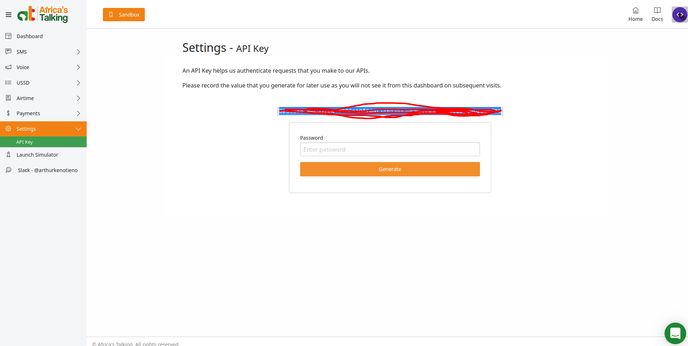
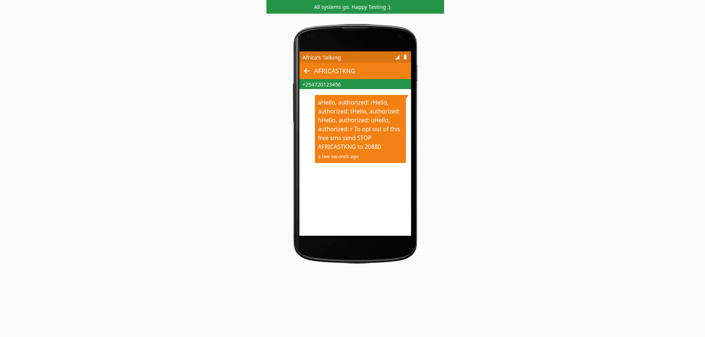

# Setting up 

+ Install OpenCV
+ Install Python3 Pip
+ Install Dependencies
    - `pip install -r requirements.txt` 

+ Get an Africa's talking account
+ If testing use `sandbox` as username and use sandbox API key; if going live top up your account and use your account username and api key.

- Where to get API Key
    

- Use simulator if testing
    
